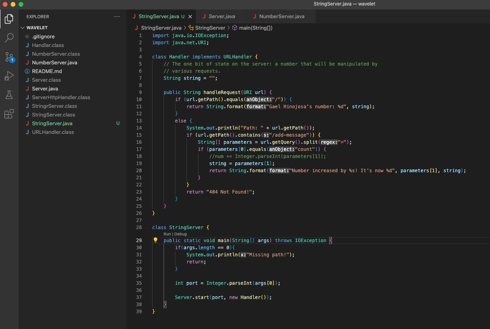

- For this lab report I struggled with trying to edit NumberServer.java from the previous lab into StringServer.java. 
- One thing I struggled with was figuring out what %d which I eventually figured out
- The main sthing that I did struggle with was finding what to do with ?s= I assumed I needed to try and use .split to try and get
- the string that came after it like "hello" and "How are you?"
